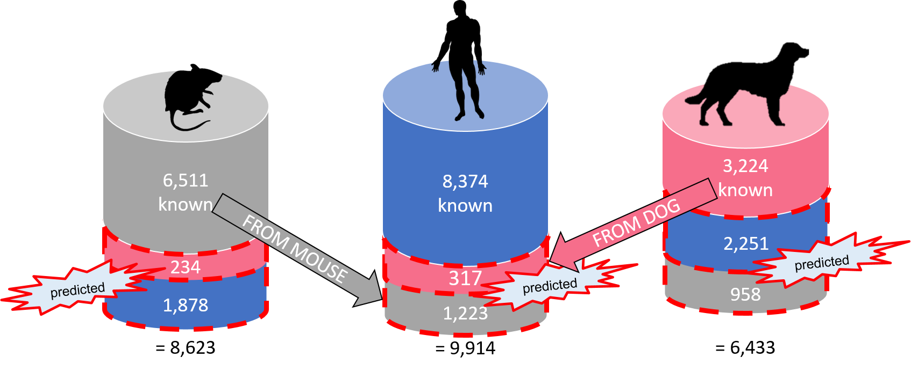
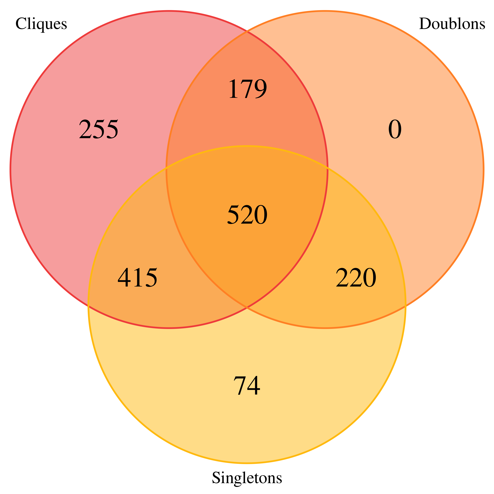
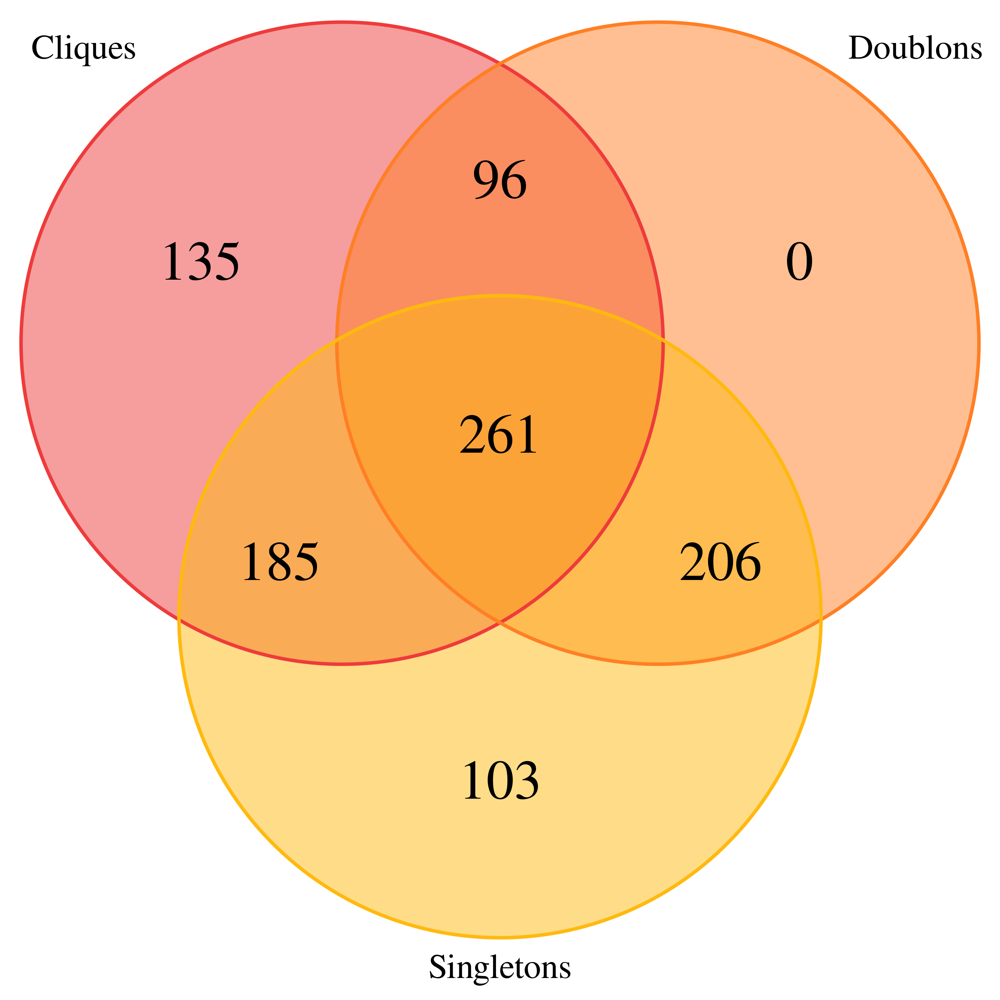
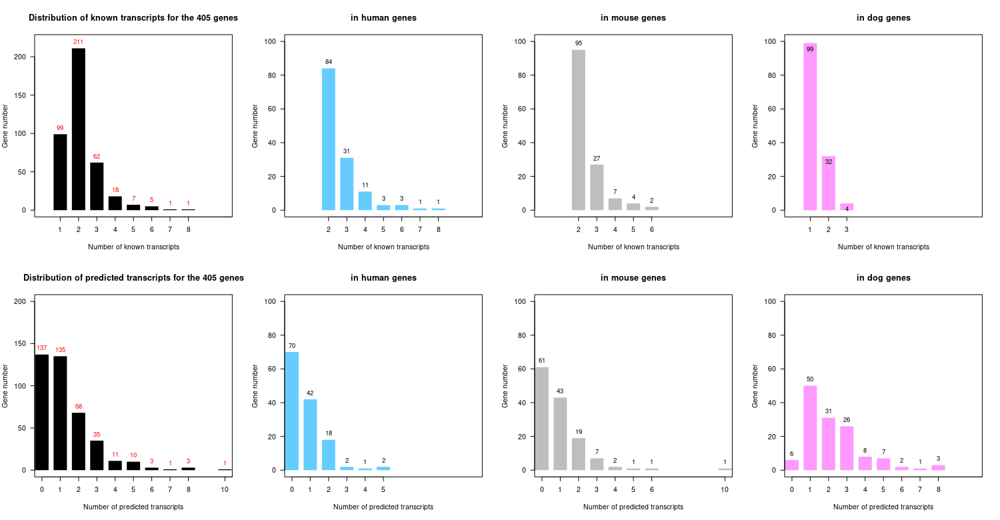
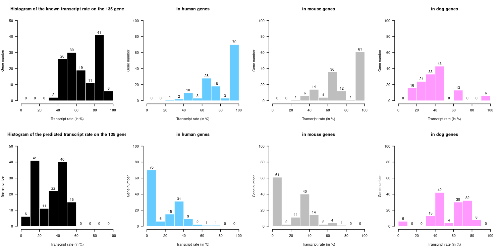

# Prediction project: Work on transcript prediction from CG-Alcode and results.

## Authors
[N. Guillaudeux](http://www.irisa.fr/dyliss/nicolas.guillaudeux), [C. Belleannée](http://www.irisa.fr/dyliss/catherine.belleannee), S. Blanquart, and J.S. Varré

## Introduction

Several mechanisms including alternative transcription and alternative splicing lead an eukaryotic gene to express a large diversity of products. The latter process allows various isoform transcripts to be build, each one made of a specific combination of genomic segments: the exons. 

We have proposed a comparative genomics method allowing to identify orthologous exons shared by a pair of orthologous genes. This method uses functional sites (start and stop codons, splice sites) known in a given source species gene to transpose them, through sequence homology search, into the orthologous gene of a target species. From orthologous exons thus identified, it is possible to estimate whether a source gene transcript has a splicing ortholog in the target gene. If this is the case, all the exons and functional sites needed to construct the source transcript must have orthologs in the target gene. The method has been validated on genes shared by human and mouse

In this work, we adapt the approach to the problem of multi-species comparison, we apply it to a set of orthologous genes shared between human (hs: _Homo sapiens_), mouse (mm: _Mus musculus_) and dog (clf: _Canis lupus familiaris_), and we predict several thousand new orthologous transcripts. We then identify a set of genes sharing in all three species the same functional sites and expressing the same transcripts. Finally, we validate some of the transcript predictions obtained from annotations and sequencing data.

## Material and method

### Dataset

We used data from three species (human, mouse and dog). The selection of data was made according to the following definitions: 
- Human and mouse, one2one orthologs, with at least two CCDS,
- human/mouse and dog, one2one orthologs, with at least one Ensembl in dog.

Dataset are based on CCDS database 21 and on Ensembl Genes 91:
- Human : GRCh38.p10
- Mouse : GRCm38.p5
- Dog : CanFam3.1

According to the definition, our dataset is composed by 2,167 genes with an orthologous relationship between the three species and contains 18,109 known transcripts.

### Software : CG-alcode

CG-alcode is a software currently under development by S. Blanquart and J.S. Varré[^fn1]. that uses known and referenced transcripts of a gene in a source species to attempt to transpose them to an orthologous target gene of a neighboring species in order to predict alternative transcripts and isoform proteins that the target gene is able to express (or "execute"), so we speak of predicted transcripts. 
Thus, CG-Alcode is defined as a method of *"assisted transcriptome reconstruction"*. This software contains a threee species comparison module based on graph construction with [NetworkX](https://networkx.github.io/) to generate graph and [Gephi](https://gephi.org/) to visualise graphs.

## Results

### Prediction

||Detailed results of prediction in the 3 pairwise comparisons: |
| --- | --- |
|We are 18,109 known transcripts and we are predicted 6,861 new predicted transcripts (1,540 in human, 2,112 in mouse and 3,209 in dog). We add 15.53%, 24.49% and 49.88% additional transcripts in human, mouse and dog respectively. All result are present in [this repertory](output_dataset/prediction "prediction_results")||

### Graphs

#### Graphs based on functional sites

| Venn diagramm | Description |
| ------------- | ----------- |
||We generated orthology relationship graphs based on functional sites (start & stop codons, splice sites) belonging to at least one transcript ORF of the studied gene. We obtained 2,141 graphs of which 1,663 were analyzed. A graph can be analyzed if there are no ambiguous cases (no orthology relationship between two species) or if all three species are present in the graphs. On the whole, 255 only include subgraphs with only three-vertex triplets meaning that all functional sites are shared between the three species. 179 also have information shared between two species against 415 that also have information found in a single species. 520 have heterogeneous information (shared between 3 species, 2 species or present only in a single species). The Venn digramm shows that 220 transcripts may be species specific and have no correspondence in the other two common species, but some may have a match in another species only. Isolated transcripts will give singletons. Since no information is shared directly between the three species, we do not find triplets with three vertices. As for the 74, these are cases where the transcripts are strictly species-specific and the possible predictions do not have valid ORF data. All functional site graphs are available [here](https://gitlab.inria.fr/niguilla/prediction_project/blob/master/output_dataset/graphs/graph_signal_set.tar.gz).|

#### Graphs based on transcript information

| Description | Venn diagramm |
| ------------- | ----------- |
|We also generated orthology relationship graphs based on transcripts. 2,098 graphs are generated and 1,663 had functional site graphs. Of these, 986 are analyzable. 135 transcript graphs have all transcripts shared between the three species for a triplet of genes considered. 103 have no transcript shared between the three species for a triplet of considered genes. All transcript graphs are available [here](https://gitlab.inria.fr/niguilla/prediction_project/blob/master/output_dataset/graphs/graph_tr_set.tar.gz).||

### Statistical analysis

#### GO term enrichment

#TO DO

#### Transcript distribution

The following two diagrams illustrate the number of known (top) / predicted (bottom) transcripts for all genes (3 * 135 = 405 genes in total) and for each species.

Two human and mouse genes are considered orthologous if they have at least two alternative transcripts in CCDS whereas a single transcript is used with the dog to consider orthology. We find these definitions well through the distribution by species. It is observed that few transcripts are predicted in the human and mouse models. Instead, the dog is a species poorly documented, predicted transcripts are distributed to advantage in this species compared to the other two species. Only 6 canine genes did not have a prediction.

26 of 135 genes have between 40 and 49% of known transcripts. Among human genes, more than 51% have no predicted transcript. In murine genes, more than 45% of genes have no predicted transcript. As for canine genes, less than 5% of genes have no predicted transcript, ie more than 95% of genes that have predicted transcripts.

#### Validation of predictions

#TO DO

For all 135 genes conserved among our three species, we have a total of 98 transcripts predicted in human, 131 in mouse and 312 in dog. All files used for the analysis are accessible [here](https://gitlab.inria.fr/niguilla/prediction_project/tree/master/output_dataset/data_135/). For each species, you can find
 - the .gtf file with all information
 - the .bed (BED12) file with transcript composition,
 - the .fasta file with the predicted transcript sequences
 - the list of 135 conserved genes.

We also use reference data to try tro validate our predicted transcripts. We use:
 - the .gtf files from Ensembl release 96 for [human](ftp://ftp.ensembl.org/pub/release-96/gtf/homo_sapiens), [mouse](ftp://ftp.ensembl.org/pub/release-96/gtf/mus_musculus) and [dog](ftp://ftp.ensembl.org/pub/release-96/gtf/canis_familiaris).
 - the .gtf files from [XBSeq](https://github.com/Liuy12/XBSeq) [^fn2] for [human](https://github.com/Liuy12/XBSeq_files/tree/master/GTF/Homo%20sapiens/hg38) and [mouse](https://github.com/Liuy12/XBSeq_files/tree/master/GTF/Mus%20musculus/mm10).
 - the .bed files from [UCSC Table Browser](https://genome.ucsc.edu/cgi-bin/hgTables) [^fn3] for the three species.
 - the .gtf file from FEELnc tool [^fn4] developed at the [IGDR](https://igdr.univ-rennes1.fr/fr).
All .gtf files are converted in .bed formats and a correction are realize to delete UTR information. All files are available [here](https://gitlab.inria.fr/niguilla/prediction_project/tree/master/input_dataset/reference_gtf_to_validate_prediction).

##### Validation in human:

On the 98 predicted transcripts we can find 19 transcripts already known in Ensembl, 6 from XBSeq data and 1 from UCSC data. In total, 26 predicted transcripts have a correspondance already known (26.53% of prediction for the 135 human genes).

##### Validation in mouse:

On the 131 predicted transcripts we can find 27 transcripts already known in Ensembl, 8 were found in the XBSeq data, 3 of which already corresponded to the Ensembl data and 3 from the UCSC data. These three transcripts were already contained in the other two datasets and the last is even found in the results of the other two datasets. In total, 32 predicted transcripts have a correspondance already known (24.43% of prediction for the 135 mouse genes).

##### Validation in dog:

No transcript was found in those of Ensembl and UCSC. With Feelnc data we are found 111 predicted transcripts. In total, 111 predicted transcripts have a correspondance already known (35.58% of prediction for the 135 dog genes).

| Species                                     | _Homo sapiens_ | _Mus musculus_ | _Canis lupus familiaris_ |
| ------------------------------------------- | -------------- | -------------- | ------------------------ |
| Known transcripts in _Ensembl 90_           | 364            | 331            | 175                      |
| Predicted transcripts                       | 98             | 131            | 312                      | 
| Predicted transcripts found in _Ensembl 96_ | 19             | 27             | 0                        |
| Predicted transcripts found in _XBSeq_ data | 6              | 8              | -                        |
| Predicted transcripts found in _UCSC_ data  | 1              | 3              | 0                        |
| Predicted transcripts found in _Feeln_ data | -              | -              | 111                      |
| Total predicted transcripts validated       | 26 (26.53%)    | 32 (24.43%)    | 111 (35.58%)             |

## Reference

[^fn1]: Blanquart, S., Varré, J.-S., Guertin, P., Perrin, A., Bergeron, A., & Swenson, K. M. (2016). Assisted transcriptome reconstruction and splicing orthology. BMC Genomics, 17(10), 786. https://doi.org/10.1186/s12864-016-3103-6
[^fn2]: Chen, H.-I. H., Liu, Y., Zou, Y., Lai, Z., Sarkar, D., Huang, Y., & Chen, Y. (2015). Differential expression analysis of RNA sequencing data by incorporating non-exonic mapped reads. BMC Genomics, 16(7), S14. https://doi.org/10.1186/1471-2164-16-S7-S14
[^fn3]: Karolchik, D., Hinrichs, A. S., Furey, T. S., Roskin, K. M., Sugnet, C. W., Haussler, D., & Kent, W. J. (2004). The UCSC Table Browser data retrieval tool. 32(9), 493–496. https://doi.org/10.1093/nar/gkh103
[^fn4]: Wucher, V., Legeai, F., Rizk, G., Lagoutte, L., Leeb, T., Jagannathan, V., … Derrien, T. (2017). FEELnc : a tool for long non-coding RNA annotation and its application to the dog transcriptome. 45(8), 1–12. https://doi.org/10.1093/nar/gkw1306